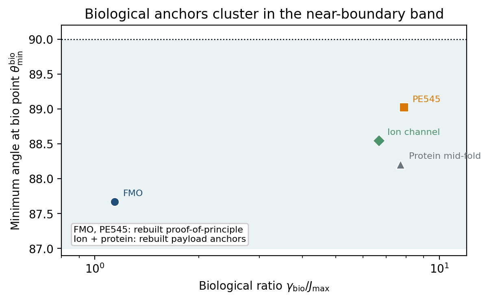
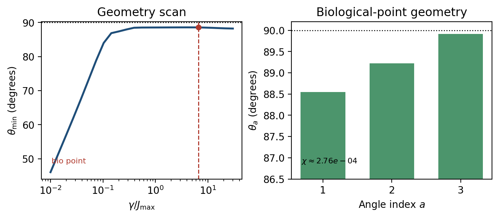
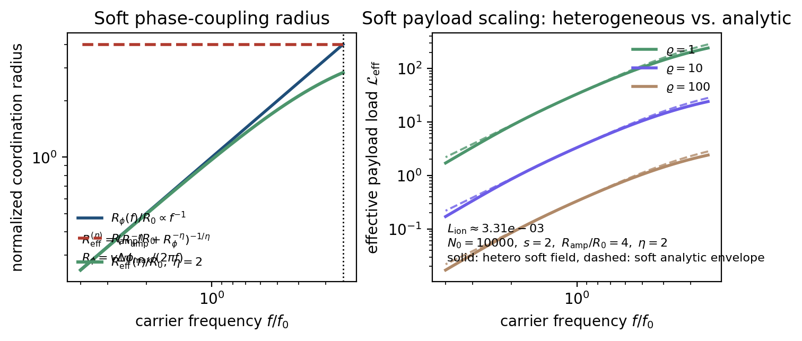

# Information Geometry of Classical Carriers and Non-Classical Payloads

This repository is a fresh rebuild of the biological information-geometry project.

The new paper is organized around one claim:

$$
\text{dimensionality lives in the coordinated payload, not in the carrier frequency.}
$$

The carrier/payload split is:

$$
\chi_{\mathrm{carrier}} \approx 0,
\qquad
\chi_{\mathrm{payload}} > 0,
$$

where $\chi$ is the non-classicality index derived from Bures principal angles.

## Core idea

Decoherence maps a $d$-level quantum system from a $(d^2-1)$-dimensional Bures state manifold onto a $(d-1)$-dimensional Fisher-Rao simplex:

$$
d^2 - 1 \longrightarrow d - 1.
$$

This gives a continuous measure of non-classicality:

$$
\chi(\rho) = \frac{1}{d-1}\sum_{a=1}^{d-1}\cos^2\theta_a,
$$

with:

- $\chi = 0$ for geometrically classical states
- $\chi > 0$ when coherence directions remain geometrically accessible

The new manuscript uses that geometry to argue:

1. Molecular biological systems can sit near the quantum-classical boundary.
2. Macroscopic neural oscillations are deep classical at carrier scale.
3. Low-frequency waves can still support higher effective dimensionality by coordinating larger non-classical molecular payloads, with ion channels as the primary neural payload example.

## Ion-channel anchor

The rebuilt repo now includes one concrete neural payload computation in
[code/ion_channel_payload.py](/Users/iantodd/Projects/highdimensional/physics/70_decoherence_dimensional_collapse/code/ion_channel_payload.py).

For the minimal KcsA-like 4-site selectivity-filter model:

$$
\gamma_{\mathrm{bio}}/J_{\max} = 6.67,
\qquad
\theta_{\min} \approx 88.55^\circ,
\qquad
\chi \approx 2.76\times 10^{-4}.
$$

So the ion-channel payload is not strongly quantum and not fully classical. It is
boundary-near and slightly non-classical in exactly the sense the paper needs.

A compact sensitivity sweep over
$$
J_{\max}\in\{15,20,30,40\}\,\mathrm{cm}^{-1},
\qquad
\gamma\in\{100,150,200,250,300\}\,\mathrm{cm}^{-1}
$$
keeps the same qualitative result:
$$
86.43^\circ \le \theta_{\min} \le 88.93^\circ,
\qquad
1.53\times10^{-4}\le \chi \le 1.55\times10^{-3}.
$$
So the ion-channel anchor is parameter-sensitive, but not a one-point artifact.

The generated summary files are:

- [results/photosynthetic_anchor_points.csv](/Users/iantodd/Projects/highdimensional/physics/70_decoherence_dimensional_collapse/results/photosynthetic_anchor_points.csv)
- [results/photosynthetic_anchor_runs.csv](/Users/iantodd/Projects/highdimensional/physics/70_decoherence_dimensional_collapse/results/photosynthetic_anchor_runs.csv)
- [results/protein_microdomain_summary.json](/Users/iantodd/Projects/highdimensional/physics/70_decoherence_dimensional_collapse/results/protein_microdomain_summary.json)
- [results/protein_microdomain_scan.csv](/Users/iantodd/Projects/highdimensional/physics/70_decoherence_dimensional_collapse/results/protein_microdomain_scan.csv)
- [results/ion_channel_summary.json](/Users/iantodd/Projects/highdimensional/physics/70_decoherence_dimensional_collapse/results/ion_channel_summary.json)
- [results/ion_channel_scan.csv](/Users/iantodd/Projects/highdimensional/physics/70_decoherence_dimensional_collapse/results/ion_channel_scan.csv)
- [results/ion_channel_sensitivity.csv](/Users/iantodd/Projects/highdimensional/physics/70_decoherence_dimensional_collapse/results/ion_channel_sensitivity.csv)
- [results/ion_payload_benchmarks.csv](/Users/iantodd/Projects/highdimensional/physics/70_decoherence_dimensional_collapse/results/ion_payload_benchmarks.csv)
- [results/threshold_scaling_scan.csv](/Users/iantodd/Projects/highdimensional/physics/70_decoherence_dimensional_collapse/results/threshold_scaling_scan.csv)
- [results/biological_anchor_points.csv](/Users/iantodd/Projects/highdimensional/physics/70_decoherence_dimensional_collapse/results/biological_anchor_points.csv)
- [figures/biological_anchor_map.pdf](/Users/iantodd/Projects/highdimensional/physics/70_decoherence_dimensional_collapse/figures/biological_anchor_map.pdf)
- [figures/ion_channel_anchor.pdf](/Users/iantodd/Projects/highdimensional/physics/70_decoherence_dimensional_collapse/figures/ion_channel_anchor.pdf)
- [figures/threshold_entrainment_scaling.pdf](/Users/iantodd/Projects/highdimensional/physics/70_decoherence_dimensional_collapse/figures/threshold_entrainment_scaling.pdf)




## Current anchor set

| System | Role | Source | `γ_bio/J_max` | `θ_min^bio` | Current use |
|---|---|---|---:|---:|---|
| FMO | Proof of principle | Rebuilt from validated Hamiltonian | 1.14 | 87.67° | Functional near-boundary photosynthesis anchor |
| PE545 | Proof of principle | Rebuilt from validated Hamiltonian | 7.88 | 89.02° | Independent photosynthetic confirmation of the same band |
| Ion channel | Primary neural payload | Rebuilt computation | 6.67 | 88.55° | Fresh rebuilt-repo molecular anchor |
| Protein mid-fold | Secondary payload | Rebuilt computation | 7.69 | 88.21° | Fresh secondary payload anchor |
| Neural oscillation | Carrier scale | Rebuilt proxy + theory | `≫1` | `→90°` | Gamma proxy gives `θ_min ≈ 89.78°`, `χ ≈ 3.72×10^-6` already at `γ/J_max = 50` |

The new anchor map is the compact visual summary: FMO, PE545, and the rebuilt ion-channel point all sit in the same near-boundary band. That is the concrete reason photosynthesis remains in the paper. It is the proof of principle that functional biology can inhabit this regime, and the ion-channel point then shows that a neural payload candidate can inhabit it too.

The rebuilt repo now also includes one secondary non-ion payload anchor in
[code/protein_microdomain_payload.py](/Users/iantodd/Projects/highdimensional/physics/70_decoherence_dimensional_collapse/code/protein_microdomain_payload.py).
For the illustrative 6-site mid-fold network:

$$
\gamma_{\mathrm{bio}}/J_{\max} = 7.69,
\qquad
\theta_{\min} \approx 88.21^\circ,
\qquad
\chi \approx 3.66\times 10^{-4}.
$$

That matters because it shows the payload story is not specific to ion conduction. A second low-entropy molecular machine lands in the same near-boundary band.

The reduced rebuilt-repo photosynthesis path now also computes the optimum-point geometry:

- FMO: `γ_opt/J_max ≈ 1.53`, `θ_min^opt ≈ 87.96°`, `η_opt ≈ 0.824`
- PE545: `γ_opt/J_max ≈ 7.87`, `θ_min^opt ≈ 89.02°`, `η_opt ≈ 0.941`

That is enough to support the proof-of-principle claim without restoring the entire old figure stack.

In local-load units `L = \chi(d^2-d)`, the rebuilt biological points give:

- FMO: `L_bio ≈ 2.28×10^-2`
- PE545: `L_bio ≈ 4.93×10^-3`
- Ion channel: `L_bio ≈ 3.31×10^-3`

That matters because it shows the ion-channel payload anchor is not being forced into a qualitatively different regime; it is already the same order as PE545.

## Neural carrier proxy

The rebuilt repo now also includes a reduced neural carrier computation in
[code/neural_carrier_proxy.py](/Users/iantodd/Projects/highdimensional/physics/70_decoherence_dimensional_collapse/code/neural_carrier_proxy.py).

For the synthetic gamma-band microcircuit:

- `γ/J_max = 1`: `θ_min ≈ 89.43°`, `χ ≈ 3.29×10^-5`
- `γ/J_max = 10`: `θ_min ≈ 89.74°`, `χ ≈ 5.58×10^-6`
- `γ/J_max = 50`: `θ_min ≈ 89.78°`, `χ ≈ 3.72×10^-6`

That is the rebuilt carrier-side evidence for the paper’s split:

$$
\chi_{\mathrm{carrier}} \ll \chi_{\mathrm{payload}}.
$$

At the conservative proxy point `γ/J_max = 50`, the carrier `χ` is already about `74×` smaller than the ion-channel payload `χ` at its biological point.

## Main scaling objects

For module $i$ with local dimension $d_i$ and non-classicality $\chi_i$, define the local non-classical load

$$
L_i = \chi_i(d_i^2-d_i).
$$

For an entrained set of modules $E$, define the redundancy-adjusted payload

$$
\mathcal{L}_{\mathrm{eff}}(E)
=
\frac{1}{\varrho_E}\sum_{i\in E} L_i,
\qquad
\varrho_E \ge 1,
$$

and the coordinated dimensionality

$$
D_{\mathrm{coord}}(E)
=
\sum_{i\in E}(d_i-1) + \mathcal{L}_{\mathrm{eff}}(E).
$$

This is the paper's working thesis:

$$
f \downarrow \;\Longrightarrow\; |E(f)| \uparrow
\;\Longrightarrow\;
D_{\mathrm{coord}}(E(f)) \uparrow,
$$

provided the payload statistics remain comparable and redundancy stays bounded.

The manuscript now also includes a minimal phase-window carrier bridge:

$$
R_{\mathrm{eff}}(f)=\min\!\left(R_{\mathrm{amp}},R_{\phi}(f)\right),
\qquad
R_{\phi}(f)=\frac{v\,\Delta\phi_{\max}}{2\pi f},
$$

so that, in the phase-limited regime of the phase-window toy model,

$$
D_{\mathrm{coord}}(E(f)) \propto f^{-s}.
$$

This is not a fitted cortical law. It is the first explicit model in the rebuilt draft showing how lower-frequency carriers can yield higher coordinated dimensionality while remaining classical, while also saturating once the amplitude ceiling is reached.

Using the actual ion-channel anchor, the local payload load is

$$
L_{\mathrm{ion}}=\chi(d^2-d)\approx 3.31\times 10^{-3}
$$

per channel at the biological point. The new phase-window scaling figure then plots

$$
\mathcal{L}_{\mathrm{eff}}(f)\approx \frac{N_0L_{\mathrm{ion}}}{\varrho}
\min\!\left(\frac{R_{\mathrm{amp}}}{R_0},\frac{f_0}{f}\right)^s
$$

for illustrative redundancy assumptions, so the bridge figure now carries actual rebuilt-repo numbers rather than only a normalized schematic.

For homogeneous payload modules, the fractional uplift above the classical baseline is

$$
\Phi = \frac{\mathcal{L}_{\mathrm{eff}}}{N(d_m-1)}=\frac{\chi d_m}{\varrho}.
$$

For the ion-channel anchor \((d_m=4)\),

$$
\Phi_{\mathrm{ion}}\approx \frac{1.10\times 10^{-3}}{\varrho}.
$$

So the rebuilt draft is making a sober claim: the per-module uplift is small, but the absolute payload still scales linearly with entrained site count.

The manuscript now includes a compact benchmark table and the same numbers are written to:

- [results/ion_payload_benchmarks.csv](/Users/iantodd/Projects/highdimensional/physics/70_decoherence_dimensional_collapse/results/ion_payload_benchmarks.csv)



## Files

- [paper.tex](/Users/iantodd/Projects/highdimensional/physics/70_decoherence_dimensional_collapse/paper.tex): main manuscript
- [references.bib](/Users/iantodd/Projects/highdimensional/physics/70_decoherence_dimensional_collapse/references.bib): bibliography
- [reader_guide.md](/Users/iantodd/Projects/highdimensional/physics/70_decoherence_dimensional_collapse/reader_guide.md): section-by-section reading guide
- [build.sh](/Users/iantodd/Projects/highdimensional/physics/70_decoherence_dimensional_collapse/build.sh): local LaTeX build script
- [code/photosynthetic_anchors.py](/Users/iantodd/Projects/highdimensional/physics/70_decoherence_dimensional_collapse/code/photosynthetic_anchors.py): reduced FMO/PE545 proof-of-principle computations
- [code/protein_microdomain_payload.py](/Users/iantodd/Projects/highdimensional/physics/70_decoherence_dimensional_collapse/code/protein_microdomain_payload.py): illustrative protein mid-fold payload anchor
- [code/ion_channel_payload.py](/Users/iantodd/Projects/highdimensional/physics/70_decoherence_dimensional_collapse/code/ion_channel_payload.py): minimal ion-channel payload analysis
- [code/neural_carrier_proxy.py](/Users/iantodd/Projects/highdimensional/physics/70_decoherence_dimensional_collapse/code/neural_carrier_proxy.py): reduced neural carrier geometry proxy

## Build

```bash
./build.sh
```

`build.sh` uses cached reduced-anchor outputs by default and only recomputes them if they are missing.

To force a full numerical refresh:

```bash
REBUILD_ANCHORS=1 ./build.sh
```

This produces:

- `paper.pdf`
- `results/photosynthetic_anchor_points.csv`
- `results/photosynthetic_anchor_runs.csv`
- `results/protein_microdomain_summary.json`
- `results/protein_microdomain_scan.csv`
- `results/ion_channel_summary.json`
- `results/ion_channel_scan.csv`
- `results/ion_channel_sensitivity.csv`
- `results/ion_payload_benchmarks.csv`
- `results/threshold_scaling_scan.csv`
- `results/biological_anchor_points.csv`
- `results/neural_carrier_proxy.csv`
- `figures/biological_anchor_map.pdf`
- `figures/ion_channel_anchor.pdf`
- `figures/threshold_entrainment_scaling.pdf`

## Current scope

This repo is intentionally narrow at the moment:

- manuscript-first rebuild
- theory and positioning first
- only the anchor computations the draft currently uses: reduced photosynthesis proof of principle plus ion-channel payload geometry

The old overhaul is preserved at git tag `big-overhaul-checkpoint`.
